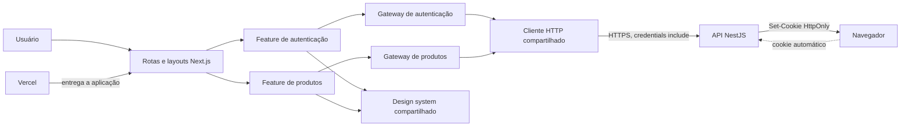

# Design Técnico — Interface web de autenticação e gestão de produtos

| Status       | Aprovado   |
|--------------|------------|
| Created      | 2026-09-05 |
| Last Updated | 2026-09-05 |

PRD de referência: `.specs/autenticacao-e-gestao-de-produtos/PRODUCT-REQUIREMENTS.md` (Aprovado)

## Histórico de atualizações

| Data       | Alteração |
|------------|-----------|
| 2026-09-05 | Versão inicial consolidada a partir do PRD aprovado, das ADRs do front-end e do contrato operacional da API; apresentada para revisão do Gate 2. |
| 2026-09-05 | Design técnico aprovado pelo solicitante (Gate 2). |

## Contexto técnico e estado atual

O repositório contém a documentação aprovada, as regras de implementação e o PRD, mas ainda não possui aplicação executável, manifesto de dependências ou código-fonte. Portanto, não há componentes de runtime a reutilizar ou migrar. A base reutilizável é o conjunto de decisões já aceitas: organização por features, consumo direto da API NestJS, autenticação por cookie `HttpOnly`, catálogo paginado por cursor, identidade visual governada por tokens semânticos e publicação independente na Vercel.

A aplicação será criada como um front-end Next.js com App Router. O servidor do front-end entrega a composição estática e pública; toda operação autenticada parte do navegador diretamente para a API. A API permanece responsável por cadastro, sessão, autorização, validação definitiva, CORS, proteção de origem, persistência e rate limit.

As principais limitações existentes são:

- o cookie de sessão pertence ao host da API e não pode ser lido pelo JavaScript nem pelo servidor do Next.js;
- não existe endpoint dedicado para consultar a sessão;
- o cursor de paginação é opaco e só permite navegação sequencial;
- a API aceita qualquer URL HTTP(S) de imagem; o front-end deve carregá-la diretamente no navegador sem impor uma allowlist própria;
- domínios de preview de terceiros não compartilham a sessão `SameSite=Strict` de produção;
- não há meta numérica de latência ou disponibilidade definida pelo PRD.

## Objetivos técnicos e limites da solução

A solução técnica deve:

- separar composição de rotas, comportamento das features, primitivas visuais e infraestrutura transversal;
- manter a menor fronteira cliente necessária para formulários, navegação e dados autenticados;
- concentrar política HTTP comum em um único cliente e manter endpoints, payloads e mensagens dentro das respectivas features;
- validar entradas antes do envio e validar respostas externas antes de incorporá-las ao estado da interface;
- representar loading, vazio, sucesso, validação, não encontrado, sessão inválida, rate limit e falha inesperada como estados explícitos;
- manter o cursor apenas na memória da sequência de navegação e expor na URL somente estado público e estável;
- impedir que JWT, cookie, senha ou detalhes internos entrem em estado persistente, logs ou mensagens;
- construir a interface exclusivamente sobre os tokens e componentes governados pelo design system aprovado;
- permitir validação automatizada do contrato, dos componentes, da acessibilidade e dos fluxos integrados.

A solução termina na interface web e na integração com a API existente. Ela não altera endpoints, persistência, autenticação, infraestrutura ou regras de domínio do back-end.

## Escopo técnico, exclusões e evoluções futuras

### Dentro do escopo técnico

- Bootstrap da aplicação Next.js e do pipeline de qualidade.
- Composição de rotas públicas e protegidas no App Router.
- Features de autenticação e produtos com componentes, schemas, tipos, gateways e estados próprios.
- Cliente HTTP transversal para consumo direto da API.
- Validação de payloads de entrada, respostas de sucesso e schema de erro.
- Estado local de formulários, operações e paginação sequencial.
- Componentes compartilhados e tokens do design system com Tailwind CSS e shadcn/ui.
- Estratégia segura para imagens remotas.
- Testes unitários, de componentes, de contrato e E2E.
- Build em container, CI e publicação independente na Vercel.

### Exclusões

- Alterações na API, no DynamoDB ou no contrato de autenticação — pertencem ao repositório do back-end e não são necessárias para o escopo aprovado.
- Endpoint de sessão, BFF, Route Handler, Server Action, Proxy ou Middleware de autenticação — duplicariam responsabilidades da API e não teriam acesso legítimo ao cookie host-only.
- Persistência de sessão ou cursor em `localStorage`, `sessionStorage` ou cookie próprio — ampliaria a superfície de segurança e criaria estado obsoleto.
- Biblioteca global de estado ou cache de dados — o volume de estado e os fluxos atuais não justificam outra fonte de verdade.
- Retry automático de mutações — pode duplicar operações e contrariar o feedback de rate limit.
- Proxy de imagens ou wildcard remoto irrestrito — adicionaria infraestrutura ou permitiria origens não governadas.
- Tema escuro, busca, filtros, ordenação configurável, upload, pedidos e papéis — estão fora do PRD aprovado.
- Telemetria de produto ou serviço externo de monitoramento do navegador — não há requisito de produto ou operação que justifique coleta adicional.

### Evoluções futuras

- Um endpoint explícito de sessão poderá substituir a leitura mínima usada na rota de criação, se for adicionado ao contrato da API.
- Uma biblioteca de cache cliente poderá ser introduzida se surgirem invalidações concorrentes, sincronização entre telas ou volume que exceda a coordenação local.
- Busca, filtros ou acesso aleatório poderão evoluir a paginação somente após mudança correspondente no contrato da API.
- A política de imagens poderá crescer para um catálogo de origens ou serviço dedicado quando houver governança de mídia no produto.
- Tema escuro poderá reutilizar os mesmos papéis semânticos depois de aprovada uma nova matriz de contraste.

## Arquitetura e componentes

- **Composição de rotas** — declara layouts, páginas, metadados e boundaries. Compõe as features e permanece livre de regras de formulário e detalhes HTTP.
- **Telas públicas de autenticação** — coordenam cadastro e login, seus estados locais, feedback e navegação. Não persistem credenciais nem conhecem o formato interno do cliente HTTP.
- **Shell de experiência protegida** — oferece navegação e logout comuns, mas não declara uma sessão como válida por conta própria. A confirmação real vem de uma operação protegida da API.
- **Controladores de tela de produtos** — coordenam leitura, paginação, criação, edição, exclusão, cancelamento de requisições e estados mutuamente exclusivos.
- **Gateways de autenticação e produtos** — representam os casos de integração de cada feature. Conhecem endpoints, métodos, payloads e schemas de sucesso, mas delegam transporte e erro comum ao cliente HTTP.
- **Cliente HTTP compartilhado** — aplica URL base, credenciais, serialização, cancelamento e interpretação comum de respostas. Não contém regras de autenticação, produtos, navegação ou mensagens de negócio.
- **Schemas e mapeadores de feature** — validam formulários e fronteiras externas, normalizam valores permitidos e convertem erros reconhecidos em dados utilizáveis pela UI.
- **Estado de paginação** — mantém em memória a pilha de cursores de requisição, o índice visitado e a resposta corrente. Nunca interpreta o cursor nem deriva total de páginas.
- **Primitivas e variantes do design system** — fornecem controles acessíveis, tokens semânticos, feedback, skeletons, estado vazio e confirmação destrutiva. Não conhecem endpoints ou tipos de domínio.
- **Boundary de imagens de produto** — usa `next/image` com `unoptimized` para carregar diretamente a URL HTTP(S) validada pela API e apresenta fallback acessível quando o carregamento falhar.
- **Suítes de teste e pipeline** — verificam schemas, cliente HTTP, componentes, acessibilidade, fluxos integrados e build reproduzível.

Comunicação entre componentes:

1. A composição de rota entrega uma tela da feature.
2. A tela interativa chama o gateway da própria feature.
3. O gateway valida a entrada e solicita transporte ao cliente HTTP.
4. O cliente HTTP chama a API diretamente e devolve sucesso validado ou erro comum tipado.
5. O gateway converte o resultado para o estado de domínio da feature.
6. A tela renderiza uma variante explícita e decide navegação, retry manual ou feedback.

O fluxo entre navegador e API é síncrono por HTTP. Não há fila, evento assíncrono, sincronização em background nem persistência no front-end.

## Tecnologias e responsabilidades

| Tecnologia ou mecanismo | Responsabilidade que atende | Já existe ou será introduzida | Requisito ou restrição que influencia | Dependências ou riscos que cria |
|------------------------|----------------------------|------------------------------|---------------------------------------|---------------------------------|
| Next.js com App Router | Rotas, layouts, boundaries, composição server-first e build da aplicação | Aprovado documentalmente; será introduzido no bootstrap | Restrição de Next.js; `AGP-01` a `AGP-44` | A API da versão escolhida deve ser confirmada; uso excessivo de componentes cliente aumenta bundle e hidratação. |
| React | Componentes, interatividade e estado local das telas | Aprovado documentalmente; será introduzido | `AGP-01` a `AGP-43`, `EXPECT-01`, `EXPECT-02` | Estado mal posicionado pode duplicar fontes de verdade; boundaries precisam permanecer pequenas. |
| TypeScript em modo estrito | Contratos internos, estados discriminados e prevenção de payloads inválidos | Aprovado documentalmente; será introduzido | Restrição técnica; `EXPECT-08`, `EXPECT-09` | Tipagem estática não valida respostas em runtime e depende de schemas na fronteira. |
| Fetch e cancelamento nativos do navegador | Transporte HTTP direto, credenciais automáticas e descarte de requisições obsoletas | Mecanismo da plataforma; será encapsulado | `AGP-13` a `AGP-44`, `EXPECT-09`, `EXPECT-10` | CORS, cookie e disponibilidade da API tornam-se dependências diretas do navegador. |
| Zod | Validação de formulários, respostas e erros na fronteira externa | Aprovado documentalmente; será introduzido | `AGP-02` a `AGP-05`, `AGP-27`, `AGP-31`, `AGP-39`, `EXPECT-09` | Schemas podem divergir da OpenAPI se não houver testes de contrato e revisão coordenada. |
| Estado local por tela/feature | Orquestra formulários, requisições, feedback e paginação sem store global | Decisão aprovada; será implementado | `AGP-18` a `AGP-25`, `AGP-37`, `AGP-38` | Navegação completa ou reload descarta cursores, conforme o contrato; compartilhamento futuro exigirá revisão. |
| URL com parâmetros públicos | Preserva posição navegacional compartilhável sem expor cursor opaco | Será introduzido | `AGP-23` a `AGP-25` | URL e memória podem divergir após reload; a solução deve canonicalizar para a primeira página. |
| Tailwind CSS com tokens semânticos | Implementa identidade visual, responsividade, contraste e estados | Aprovado documentalmente; será introduzido | `EXPECT-02` a `EXPECT-06`; restrição da ADR-004 | Uso de valores locais ou tokens duplicados fragmenta o sistema visual. |
| shadcn/ui | Fornece primitivas acessíveis incorporadas e customizáveis | Aprovado documentalmente; será introduzido | `AGP-05`, `AGP-19`, `AGP-34`, `AGP-37`, `EXPECT-01` a `EXPECT-06` | A base e a API da versão instalada precisam ser confirmadas antes de compor componentes. |
| Mecanismos de fontes e imagens do Next.js | Inclui fontes no build e renderiza imagens remotas diretamente com `next/image`/`unoptimized` | Será introduzido | `AGP-26`, `AGP-29`, `AGP-30`, `EXPECT-02`, `EXPECT-10` | A disponibilidade e o formato final dependem do endereço externo; falhas devem degradar para fallback seguro. |
| Vitest, React Testing Library e user-event | Testes unitários e de componentes pelo comportamento observável | Aprovado documentalmente; será introduzido | `EXPECT-01` a `EXPECT-09` | Mocks excessivos podem ocultar divergência do contrato real. |
| Playwright | Valida cadastro, sessão, proteção, paginação, CRUD e logout no navegador | Aprovado documentalmente; será introduzido | `EXPECT-07`, `EXPECT-09`, `EXPECT-10` | Exige ambiente integrado determinístico, origem autorizada e dados isoláveis. |
| ESLint, Prettier e verificação de tipos | Padronizam qualidade estática e bloqueiam regressões no pipeline | Aprovado documentalmente; serão introduzidos | `EXPECT-08` | Regras incompatíveis ou sobrepostas podem gerar ruído; configuração deve seguir a versão do framework. |
| Docker | Ambiente de desenvolvimento e build independente do back-end | Aprovado documentalmente; será introduzido | Entregáveis e decisão de tecnologia | Requer configuração de URL da API por ambiente e não resolve compatibilidade de cookie em preview. |
| Vercel e GitHub Actions | Preview, build, promoção, rollback e gates automatizados | Aprovado documentalmente; serão configurados | `EXPECT-08`, `EXPECT-10` | Previews de terceiros não usam a sessão de produção; a URL pública da API precisa ser coordenada. |

Alternativas relevantes estão registradas nas decisões `DEC-01` a `DEC-12`; versões e comandos permanecem fora deste documento porque pertencem ao plano e à implementação.

## Fluxo de dados e integrações

### Cadastro

1. O visitante informa nome, e-mail e senha — formulário → schema da feature (local e síncrono).
2. A entrada válida segue para o gateway de autenticação — tela → gateway (função assíncrona).
3. O gateway solicita `POST /auth/register` — navegador → API (REST/HTTPS síncrono, com credenciais incluídas).
4. Em `201`, a resposta segura é validada e a tela navega para o login com um sinal transitório público de sucesso, sem dado pessoal.
5. Em falha, o erro tipado é mapeado para campos ou feedback geral; a senha permanece somente no estado efêmero do formulário.

### Login e confirmação de sessão

1. O usuário informa e-mail e senha e passa pela validação local.
2. O gateway solicita `POST /auth/login`; em `204`, o navegador recebe o cookie `HttpOnly` sem expô-lo ao código.
3. A tela navega para a página inicial protegida.
4. A página inicial solicita a primeira página de produtos; o sucesso confirma a sessão e entrega os dados, enquanto `401` redireciona ao login.
5. Consulta e edição usam a leitura do próprio produto para confirmar a sessão.
6. A rota de criação, por não possuir leitura natural inicial, solicita uma página mínima de produtos apenas para validar a sessão antes de liberar o formulário.

### Listagem e paginação

1. A tela inicia com uma pilha contendo o cursor vazio da primeira página e índice zero.
2. O gateway solicita `GET /products` com limite padrão e o cursor associado ao índice atual, quando houver.
3. A resposta validada substitui o estado corrente com `items`, `total` e `nextCursor` sem transformação semântica.
4. Em `Próxima`, o `nextCursor` atual é anexado à pilha e o índice avança; a nova página é carregada.
5. Em `Anterior`, o índice recua e o cursor já visitado é reutilizado.
6. A URL expõe somente a posição pública visitada. Se um reload perder a pilha necessária, a tela retorna à primeira página e canonicaliza a posição.

### Criação, edição e exclusão

1. Criação e edição validam e normalizam somente campos públicos do contrato.
2. O gateway envia `POST /products` ou `PATCH /products/:id`; não há retry automático.
3. Sucesso validado produz feedback persistente na área afetada e navegação coerente para o recurso ou catálogo.
4. Exclusão começa em confirmação destrutiva acessível e envia `DELETE /products/:id` uma única vez.
5. Após `204`, a tela apresenta sucesso e atualiza a visão do catálogo por nova leitura ou remoção coerente do item corrente.
6. `404` produz estado de não encontrado; `401` conduz ao login; outros erros preservam contexto e permitem correção ou retry seguro.

### Logout

1. O usuário solicita logout e o gateway envia `POST /auth/logout`.
2. Em `204`, a tela descarta apenas estado local protegido e navega ao login.
3. Como o endpoint é idempotente, cookie ausente, inválido ou expirado também resulta em conclusão bem-sucedida.

### Integração externa e falhas

A API NestJS é a única integração de runtime. Ela espera JSON nos endpoints com corpo, credenciais incluídas pelo navegador e origem autorizada nas mutações. O front-end espera respostas e erros compatíveis com a OpenAPI. Falha de rede, CORS, resposta malformada, `500` ou status não reconhecido convertem-se em erro seguro e recuperável; nenhum detalhe bruto chega à interface.

## Contratos de API, eventos ou interfaces

Todas as operações partem do navegador para `NEXT_PUBLIC_API_URL`, usam `credentials: include`, não usam `Authorization: Bearer` e não adicionam cabeçalho CSRF. O navegador fornece `Origin` ou `Referer` quando aplicável. Respostas com corpo passam por validação de runtime antes de entrar no estado.

| Contrato | Consumidor | Forma | Esquema resumido |
|----------|-----------|-------|------------------|
| `POST /auth/register` | Gateway de autenticação | REST/JSON | Entrada: `{ name: string, email: string, password: string }`; `201`: `{ id, name, email }`. |
| `POST /auth/login` | Gateway de autenticação | REST/JSON | Entrada: `{ email: string, password: string }`; `204` sem corpo e com `Set-Cookie` controlado pela API. |
| `POST /auth/logout` | Shell protegido | REST | `204` sem corpo; expira o cookie mesmo quando a sessão já estiver ausente ou inválida. |
| `GET /products?limit&cursor` | Listagem e gate da criação | REST | `200`: `{ items: Product[], total: integer >= 0, nextCursor?: string }`; limite entre 1 e 100; cursor opaco opcional. |
| `POST /products` | Formulário de criação | REST/JSON | Entrada completa: `{ name, description, price, imageUrl }`; `201`: `Product`. |
| `GET /products/:id` | Consulta e edição | REST | `200`: `Product`. |
| `PATCH /products/:id` | Formulário de edição | REST/JSON | Subconjunto não vazio de `{ name, description, price, imageUrl }`; `200`: `Product`. |
| `DELETE /products/:id` | Confirmação de exclusão | REST | `204` sem corpo. |
| Erro padrão | Todos os gateways | REST/JSON | `{ statusCode: number, code: string, message: string, correlationId: string, errors?: { field, code, message }[] }`. |
| `Retry-After` | Mapeador de rate limit | Cabeçalho HTTP | Inteiro em segundos, no mínimo 1, exposto por CORS em respostas `429`. |

`Product` contém `{ id, name, description, price, imageUrl, createdAt, updatedAt }`, com datas em ISO 8601. Os schemas de formulário espelham os limites operacionais da API: nome com 2 a 100 caracteres, descrição com 1 a 500, preço positivo com até duas casas decimais e URL HTTP(S) com até 2048 caracteres. Cadastro normaliza nome e e-mail; senha tem 8 a 128 caracteres.

O cliente diferencia quatro resultados de transporte: sucesso sem corpo, sucesso validado com corpo, erro da API validado e falha não confiável. A feature transforma esses resultados em estados de interface e nunca depende diretamente de texto livre para decidir comportamento; usa `statusCode` e `code` reconhecidos.

Não há contratos de eventos — a solução não publica nem consome mensageria.

## Modelo e alterações de dados

**Novas entidades/tabelas/coleções:** não aplicável — o front-end não persiste dados de domínio e não altera o DynamoDB.

**Modelos de integração em memória:**

- `RegisteredUser`: identificador, nome e e-mail seguros retornados pelo cadastro.
- `Product`: identificador, nome, descrição, preço, URL de imagem, data de criação e data de atualização.
- `ProductListPage`: itens, total exato do catálogo e cursor opaco opcional da próxima página.
- `ApiError`: status, código estável, mensagem segura, identificador de correlação e erros opcionais por campo.
- `PaginationState`: índice visitado, pilha de cursores de requisição e página corrente.
- Estados discriminados de leitura e mutação: carregando, vazio, sucesso, erro, não encontrado ou não autorizado, conforme o fluxo.

**Alterações em dados existentes:** não aplicável — nenhum dado local existe. Estado de formulário, sessão inferida e cursores são efêmeros e descartados em reload ou navegação que encerre o fluxo.

## Segurança, privacidade e observabilidade

- **Autenticação:** a API cria, valida e remove o cookie host-only `HttpOnly`, `Secure` e `SameSite=Strict`; o front-end apenas envia credenciais de transporte pelo mecanismo do navegador.
- **Autorização:** a API é a autoridade. Uma rota ou ação visível no front-end não prova permissão; toda operação depende da resposta da API.
- **Proteção de origem:** mutações partem somente de origem autorizada. O cliente não define `Origin`, `Referer` ou cabeçalho CSRF e não tenta contornar um `403`.
- **Segredos:** JWT e cookie nunca entram em código, estado, storage, logs, payloads ou mensagens. Não existe chave JWT ou segredo de autenticação no front-end.
- **Credenciais de usuário:** senha vive apenas no estado efêmero do formulário pelo tempo necessário à tentativa, não é persistida e deve ser descartada ao concluir ou abandonar o fluxo.
- **Validação de fronteiras:** schemas validam entradas e respostas. Dados inválidos da API são tratados como falha não confiável, não como objetos válidos da aplicação.
- **Imagens remotas:** URLs HTTP(S) validadas pela API são carregadas diretamente pelo navegador com `next/image`/`unoptimized`; falhas de carregamento recebem fallback acessível e não há proxy de imagem no front-end.
- **Privacidade:** nome e e-mail são dados pessoais enviados diretamente à API apenas para cadastro e login. O front-end não cria retenção própria nem telemetria de produto.
- **Observabilidade:** erros reconhecidos podem exibir o `correlationId` como referência de suporte. A aplicação não registra corpos de autenticação, senhas, cookies, JWTs ou respostas sensíveis. Não há serviço adicional de telemetria nesta versão.
- **Supply chain:** instalação reproduzível, lockfile, análise estática, testes e build formam o gate antes da publicação.

## Desempenho, disponibilidade e resiliência

- **Desempenho:** não há alvo numérico no PRD. A arquitetura evita dependências globais desnecessárias, mantém Server Components como padrão, restringe hidratação às fronteiras interativas, cancela leituras obsoletas e usa skeletons com geometria estável.
- **Imagens e fontes:** fontes são incluídas no build e imagens autorizadas usam o mecanismo otimizado do framework; falha ou origem não autorizada degrada para fallback sem bloquear o restante do produto.
- **Disponibilidade:** a interface pública pode carregar pela Vercel enquanto a API estiver indisponível, mas cadastro, login e catálogo dependem integralmente da API e devem apresentar falha recuperável.
- **Leituras:** falhas permitem retry manual. Requisições obsoletas são canceladas ou ignoradas para impedir atualização de estado fora de ordem.
- **Mutações:** o controle fica indisponível durante o envio e não há retry automático. Isso evita cadastro, criação, edição ou exclusão duplicada.
- **Rate limit:** `429` respeita `Retry-After`; a interface informa a espera e só realiza nova tentativa por ação do usuário.
- **Idempotência:** logout pode ser repetido com segurança segundo o contrato. As demais mutações não são presumidas idempotentes.
- **Sessão expirada:** qualquer `401` em fluxo protegido descarta o estado local protegido e redireciona ao login, sem tentar renovar o token.
- **Contrato inválido:** resposta malformada ou status não previsto usa fallback seguro e preserva `correlationId` apenas quando sua estrutura for confiável.

## Decisões, alternativas e trade-offs

| ID | Decisão | Alternativas consideradas | Motivo da escolha | Trade-offs aceitos |
|----|---------|---------------------------|-------------------|--------------------|
| `DEC-01` | Operações autenticadas partem do navegador diretamente para a API. | BFF, Route Handlers, Server Actions, Proxy ou leitura server-side. | Preserva o cookie host-only e a autoridade única da API, reduz duplicação e segue a ADR-003. | Dependência direta de CORS, origem autorizada e disponibilidade pública da API; sem proteção otimista no servidor do front-end. |
| `DEC-02` | A arquitetura usa composição de rotas, features, UI compartilhada e infraestrutura transversal com dependências unidirecionais. | Pastas globais por tipo, tudo dentro das rotas ou Clean Architecture completa no front-end. | Mantém regras próximas do domínio sem abstração desproporcional e segue a ADR-001. | Exige disciplina para não importar internos de outra feature e pode produzir mais arquivos pequenos. |
| `DEC-03` | Um cliente HTTP fino concentra transporte; gateways de feature concentram contratos; Zod valida fronteiras. | Fetch repetido nos componentes, cliente gerado integralmente da OpenAPI ou tipos estáticos sem runtime validation. | Remove duplicação sem misturar regra de domínio, mantém erros coerentes e detecta incompatibilidades reais. | Schemas manuais exigem manutenção coordenada com a OpenAPI. |
| `DEC-04` | Estado remoto e de formulário permanece local à menor tela ou feature que o utiliza. | Store global, context universal ou biblioteca de cache desde o início. | O escopo é pequeno e não exige sincronização global; reduz dependências e fontes de verdade. | Navegação pode exigir nova leitura e uma evolução futura poderá demandar outra estratégia. |
| `DEC-05` | A própria leitura protegida valida a sessão; a rota de criação usa `GET /products?limit=1` como probe mínimo. | Endpoint novo de sessão, Middleware, provider global que presume autenticação ou esperar a primeira mutação falhar. | Cumpre proteção em acesso direto sem ampliar a API e sem tentar ler o cookie. | A criação realiza uma leitura adicional e consome uma unidade do rate limit; o probe poderá ser substituído por endpoint dedicado no futuro. |
| `DEC-06` | Paginação usa pilha de cursores em memória e expõe somente posição visitada na URL. | Cursor na URL, offset/número de página inventado, armazenamento persistente ou somente botão voltar do navegador. | Preserva opacidade, suporta Anterior/Próxima e evita expor estado instável. | Reload perde a sequência e retorna à primeira página; não existe salto direto. |
| `DEC-07` | Erros são representados por resultado tipado; a feature mapeia códigos conhecidos e a UI mantém fallback seguro. | Exibir mensagens brutas, tratar somente status ou lançar exceções genéricas em todos os fluxos. | Preserva `correlationId`, permite erros por campo e impede vazamento de detalhes. | Exige mapear códigos por feature e manter fallback para evolução do contrato. |
| `DEC-08` | Mutações bloqueiam reenvio e nunca têm retry automático; leituras oferecem retry manual. | Retry automático uniforme ou atualização otimista para todas as operações. | Evita duplicidade e respeita rate limit e idempotência real dos endpoints. | Falhas transitórias exigem ação explícita do usuário e podem tornar o fluxo mais lento. |
| `DEC-09` | Feedback de sucesso entre rotas usa um sinal transitório público, sem dados pessoais ou segredo. | Storage persistente, cookie próprio, estado global ou somente toast antes da navegação. | Permite que a tela de destino confirme a operação sem criar persistência ou infraestrutura. | O sinal pode permanecer no histórico e precisa ser consumido/canonicalizado pela tela de destino. |
| `DEC-10` | Tailwind CSS implementa tokens semânticos e shadcn/ui fornece primitivas acessíveis customizadas. | CSS local, biblioteca visual fechada, componentes totalmente manuais ou múltiplos frameworks. | Aplica a ADR-004, favorece consistência, reutilização e acessibilidade. | Componentes incorporados exigem revisão e customização; duas fontes aumentam o tamanho do build. |
| `DEC-11` | Imagens remotas usam `next/image` com `unoptimized` para carregar diretamente qualquer URL HTTP(S) validada pela API e fallback para falhas. | Otimização server-side dependente de allowlist, proxy próprio ou restringir a API nesta entrega. | Mantém o front-end compatível com URLs cadastradas pelo usuário e evita configuração por origem. | O carregamento depende da disponibilidade e do formato servido pelo endereço externo. |
| `DEC-12` | A qualidade combina testes de schemas/cliente/componentes com E2E integrado e gates de CI antes do deploy. | Somente E2E, somente unitários ou validação manual. | Cobre comportamento local, contrato de fronteira e integração real em níveis proporcionais. | Ambiente E2E autorizado e determinístico aumenta o custo operacional da entrega. |

## Riscos, dependências e migração

| Risco | Impacto | Probabilidade | Mitigação |
|-------|---------|---------------|-----------|
| CORS, allowlist de origem ou domínio same-site incompatível com o ambiente | Alto | Média | Validar ambiente integrado cedo; testar credenciais, preflight e mutações em origem autorizada; documentar matriz de ambientes. |
| Divergência entre schemas do front-end e OpenAPI da API | Alto | Média | Validar respostas em runtime, manter testes de contrato e executar E2E contra versão controlada da API. |
| Ausência de endpoint de sessão gerar leitura extra na criação | Médio | Alta | Limitar o probe a um item, não duplicá-lo em telas que já fazem leitura protegida e monitorar rate limit; substituir se o contrato evoluir. |
| URL externa de imagem estar indisponível ou não servir uma imagem | Médio | Média | Carregar diretamente no navegador, manter fallback acessível e validar o formato HTTP(S) na API. |
| Cursor expirar ou ficar inválido durante navegação | Médio | Baixa | Tratar `400` como sequência inválida, limpar a pilha e oferecer retorno à primeira página. |
| Resposta atrasada sobrescrever estado mais recente | Médio | Média | Cancelar leituras ao trocar página ou desmontar a tela e ignorar resultados obsoletos. |
| Retry ou duplo clique duplicar mutação | Alto | Média | Desabilitar ação durante envio e proibir retry automático de escrita. |
| Preview da Vercel tentar reutilizar sessão de produção | Alto | Média | Usar API e origem próprias para preview ou limitar preview a validações que não dependam da sessão de produção. |
| Mensagem ou log expor credencial ou detalhe interno | Alto | Baixa | Centralizar erro seguro, proibir logging de corpos sensíveis e testar buscas residuais e respostas. |
| Falta de código existente aumentar decisões de bootstrap | Médio | Alta | Fixar versões compatíveis no plano, confirmar documentação da versão instalada e validar cada gate desde a fundação. |

Dependências externas:

- API NestJS disponível e compatível com a OpenAPI usada no desenvolvimento.
- Origem exata do front-end cadastrada no CORS e na política de origem da API.
- Domínios de produção do front-end e da API pertencentes ao mesmo site para `SameSite=Strict`.
- Origens de imagens governadas por ambiente.
- Ambiente E2E controlado com dados isoláveis e API em versão conhecida.
- Vercel, GitHub Actions e provedor DNS disponíveis para publicação.

Migração: não aplicável — não existe aplicação ou estado local anterior a migrar. O bootstrap introduz a solução do zero. Reversão de publicação usa um deployment anterior da Vercel associado a um commit conhecido; mudanças incompatíveis da API exigem coordenação entre repositórios, não migração do front-end.

## Matriz de rastreabilidade com o PRD

| Requisito do PRD | Onde o design atende | Observações |
|------------------|----------------------|-------------|
| `AGP-01` | Telas públicas, gateway de autenticação, contratos; `DEC-02`, `DEC-03` | Formulário e contrato de cadastro permanecem na feature de autenticação. |
| `AGP-02` | Schemas de feature e contratos; `DEC-03` | Nome é normalizado e validado antes do envio. |
| `AGP-03` | Schemas de feature e contratos; `DEC-03` | E-mail é normalizado e validado antes do envio. |
| `AGP-04` | Schemas de feature e contratos; `DEC-03` | A senha é validada sem persistência. |
| `AGP-05` | Mapeamento de erros e primitivas de formulário; `DEC-07`, `DEC-10` | Erros de campo permanecem associados aos controles. |
| `AGP-06` | Fluxo de cadastro e sinal transitório; `DEC-09` | Confirmação ocorre na experiência de destino. |
| `AGP-07` | Fluxo de cadastro; `DEC-09` | Navegação só ocorre após `201` validado. |
| `AGP-08` | Contrato de cadastro e segurança; `DEC-01` | `201` não é tratado como sessão; o login continua independente. |
| `AGP-09` | Mapeamento de `EMAIL_ALREADY_EXISTS`; `DEC-07` | `409` recebe mensagem segura específica. |
| `AGP-10` | Tela de login, schema e gateway de autenticação; `DEC-03` | Credenciais transitam diretamente para a API. |
| `AGP-11` | Fluxo de login e leitura inicial protegida; `DEC-01`, `DEC-05` | A sessão é confirmada pela listagem após o `204`. |
| `AGP-12` | Mapeamento de `INVALID_CREDENTIALS`; `DEC-07` | A mensagem não identifica qual credencial falhou. |
| `AGP-13` | Cookie controlado pela API e leituras protegidas; `DEC-01`, `DEC-05` | O front-end não mantém relógio ou token paralelo. |
| `AGP-14` | Resultado não autorizado e navegação; `DEC-05`, `DEC-07` | Qualquer `401` protegido conduz ao login. |
| `AGP-15` | Shell protegido e contrato de logout; `DEC-01` | Logout chama diretamente o endpoint idempotente. |
| `AGP-16` | Fluxo de logout | Navegação ocorre após `204`. |
| `AGP-17` | Tela de listagem e gateway de produtos; `DEC-02`, `DEC-03` | A página inicial usa a primeira leitura protegida. |
| `AGP-18` | `ProductListPage` e estado de paginação; `DEC-06` | Itens, total e cursor permanecem distintos. |
| `AGP-19` | Estado discriminado vazio e design system; `DEC-04`, `DEC-10` | Vazio é diferente de loading e erro. |
| `AGP-20` | Estado de paginação; `DEC-06` | Próxima depende da presença de `nextCursor`. |
| `AGP-21` | Estado de paginação e controle desabilitado; `DEC-06`, `DEC-10` | Ausência de cursor impede avanço. |
| `AGP-22` | Pilha de cursores em memória; `DEC-06` | Anterior reutiliza cursor já visitado. |
| `AGP-23` | Índice público e URL; `DEC-06` | A posição não representa total de páginas. |
| `AGP-24` | Pilha sequencial; `DEC-06` | Não existe cursor para posição não visitada. |
| `AGP-25` | Recuperação/canonicalização da paginação; `DEC-06` | Perda da pilha retorna à primeira página. |
| `AGP-26` | Formulário, schema e gateway de produtos; `DEC-03`, `DEC-11` | URL HTTP(S) é validada; renderização direta usa fallback em caso de falha. |
| `AGP-27` | Schema de produto; `DEC-03` | Limites operacionais são espelhados no cliente. |
| `AGP-28` | Fluxo de criação e feedback; `DEC-09` | Sucesso depende de `201` e resposta validada. |
| `AGP-29` | Tela de detalhe e `GET /products/:id`; `DEC-03`, `DEC-05` | A leitura também confirma a sessão. |
| `AGP-30` | Formulário de edição e contrato parcial; `DEC-03` | Somente campos públicos editáveis entram no patch. |
| `AGP-31` | Schema de patch e detecção de mudanças; `DEC-03` | Patch vazio é bloqueado antes do envio. |
| `AGP-32` | Mapeador de patch; `DEC-03` | Campos não alterados são omitidos, nunca enviados como nulos. |
| `AGP-33` | Fluxo de edição e feedback; `DEC-07`, `DEC-09` | Sucesso usa o produto validado retornado pela API. |
| `AGP-34` | Confirmação destrutiva do design system; `DEC-10` | Foco e teclado permanecem sob a primitiva acessível. |
| `AGP-35` | Fluxo de exclusão; `DEC-08`, `DEC-09` | `204` atualiza a experiência e apresenta sucesso. |
| `AGP-36` | Estado não encontrado e mapeamento `PRODUCT_NOT_FOUND`; `DEC-07` | Consulta, edição e exclusão tratam `404`. |
| `AGP-37` | Estados discriminados e skeletons; `DEC-04`, `DEC-10` | Cada operação relevante possui estado de espera observável. |
| `AGP-38` | Política de mutações; `DEC-08` | Ação fica indisponível enquanto a tentativa está ativa. |
| `AGP-39` | Resultado de erro e mapeadores por feature; `DEC-07` | Status e códigos reconhecidos determinam feedback seguro. |
| `AGP-40` | Mapeamento de rate limit; `DEC-07`, `DEC-08` | `429` não dispara nova tentativa automática. |
| `AGP-41` | Leitura de `Retry-After`; `DEC-07`, `DEC-08` | Valor válido orienta a próxima tentativa manual. |
| `AGP-42` | Falha não confiável e fallback; `DEC-07` | Rede, CORS, schema inválido e status inesperado convergem para mensagem segura. |
| `AGP-43` | `ApiError` e observabilidade; `DEC-07` | `correlationId` validado pode ser exibido como referência. |
| `AGP-44` | Segurança, privacidade e cliente HTTP; `DEC-01`, `DEC-03`, `DEC-07` | Dados sensíveis nunca entram em logs ou mensagens. |
| `EXPECT-01` | Design system, formulários e confirmação; `DEC-10`, `DEC-12` | Testes consultam papel, nome, foco e teclado. |
| `EXPECT-02` | Design system responsivo; `DEC-10`, `DEC-12` | Composição mobile-first preserva ações em todos os breakpoints. |
| `EXPECT-03` | Tokens e pares de contraste da ADR-004; `DEC-10`, `DEC-12` | Contraste é validado de forma automatizada e manual. |
| `EXPECT-04` | Layout responsivo e revisão visual; `DEC-10`, `DEC-12` | Reflow e zoom de 200% fazem parte do gate. |
| `EXPECT-05` | Variantes semânticas e feedback textual; `DEC-10` | Cor nunca é o único indicador. |
| `EXPECT-06` | Tokens de movimento e preferência reduzida; `DEC-10` | Animação é feedback não bloqueante. |
| `EXPECT-07` | Estratégia de testes; `DEC-12` | Unitários, componentes e E2E dividem responsabilidades. |
| `EXPECT-08` | Pipeline de qualidade; `DEC-12` | Lint, tipos, testes e build bloqueiam promoção. |
| `EXPECT-09` | Cliente, schemas e E2E integrado; `DEC-03`, `DEC-07`, `DEC-12` | Contrato é validado localmente e contra ambiente controlado. |
| `EXPECT-10` | Integração direta e deploy; `DEC-01`, `DEC-12` | HTTPS, same-site e origem exata são dependências de publicação. |

## Perguntas em aberto

Nenhuma. As escolhas de versão, nomes de arquivos, comandos e origens concretas de cada ambiente são detalhes de planejamento e configuração; não alteram a arquitetura definida neste documento.
