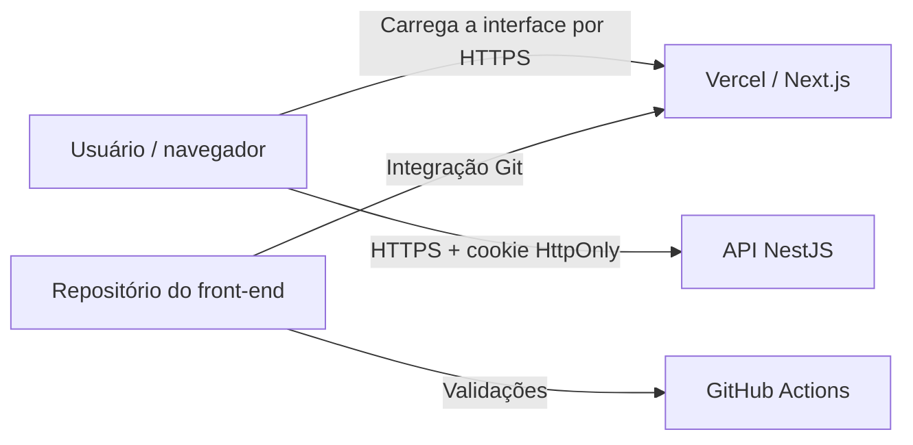

# Decisão de deploy do front-end

## Status

Aceita para o ambiente publicado do desafio.

## Contexto

O front-end precisa de um ciclo próprio de build, preview, publicação e rollback. O ambiente publicado é uma demonstração técnica e utiliza a Vercel por sua integração nativa com Next.js.

## Decisão

| Componente | Destino | Forma de entrega |
|---|---|---|
| Aplicação Next.js | Vercel | Build e deploy gerenciados a partir da raiz deste repositório. |
| API consumida pelo navegador | Serviço externo | URL HTTPS pública definida em `NEXT_PUBLIC_API_URL`. |
| DNS do front-end | Cloudflare ou provedor equivalente | Registro apontando para a Vercel. |
| CI/CD | Vercel e GitHub Actions | Preview em pull requests e validações automatizadas. |

## Arquitetura publicada

O navegador chamará a API diretamente. A Vercel não atuará como proxy e não executará endpoints intermediários para autenticação ou produtos.

## Pipeline

Antes da promoção, o pipeline deverá executar:

1. Instalação reproduzível das dependências.
2. Análise estática e verificação de tipos.
3. Testes unitários.
4. Build do Next.js.
5. Deploy de preview para pull requests.
6. Deploy de produção após merge na branch principal.

O build não dependerá de Route Handlers para integração com a API.

## Configuração

- `NEXT_PUBLIC_API_URL` apontará para a URL pública HTTPS da API e será visível no bundle do navegador.
- Variáveis de preview e produção poderão apontar para ambientes diferentes da API.
- O domínio de produção usará HTTPS gerenciado pela Vercel.
- O domínio de produção do front-end pertencerá ao mesmo site registrável da API para compatibilidade com o cookie `SameSite=Lax`.

## Segurança operacional

- O JWT será armazenado pela API em cookie `HttpOnly`, `Secure` e `SameSite=Lax`.
- O token não será enviado ao JavaScript do navegador.
- O front-end não terá segredo de autenticação nem chave do JWT.
- Logs do navegador não registrarão senhas, cookies ou respostas sensíveis.
- O cliente enviará `credentials: include` e o cabeçalho CSRF nas operações mutáveis.
- Respostas da API serão tratadas antes de serem apresentadas ao usuário.

## Rollback e observabilidade

O rollback utilizará um deployment anterior da Vercel associado a um commit conhecido. Depois da promoção ou reversão, serão verificados ao menos:

- carregamento da página pública de login;
- comunicação direta do navegador com a API;
- autenticação e acesso à página inicial protegida;
- cadastro, CRUD e logout sem endpoints intermediários.

## Consequências

### Positivas

- Publicação e previews integrados ao fluxo de pull requests.
- Menos processamento server-side e nenhum proxy de API na Vercel.
- Deploy e rollback independentes da API.

### Negativas

- O navegador depende de CORS e da disponibilidade pública da API.
- A experiência depende da disponibilidade e da compatibilidade do contrato da API.
- Previews em domínio de terceiro não reutilizam a autenticação `SameSite=Lax` de produção.
