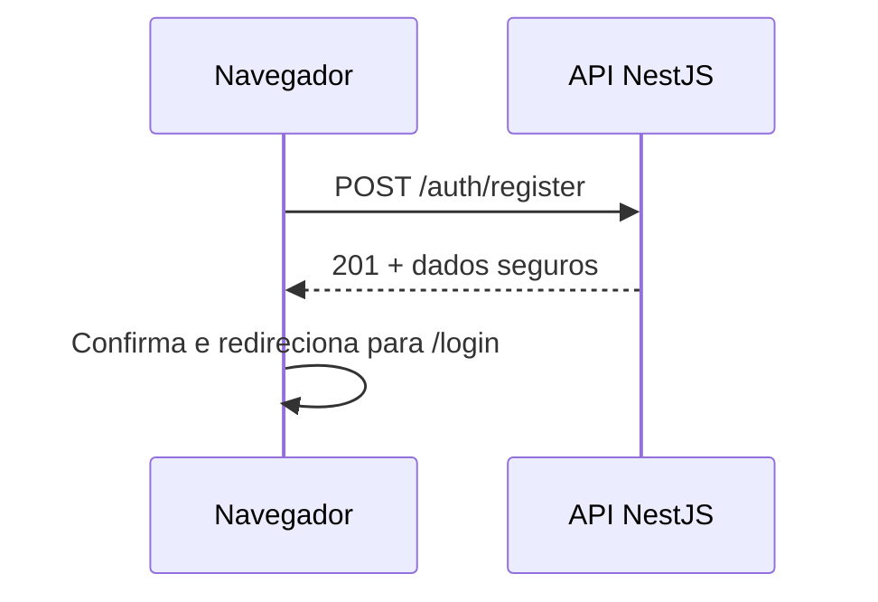

# ADR-002: Cadastro de usuários no front-end

## Status

Aceita

## Data da decisão

2026-09-02

## Documentos relacionados

- [Requisitos do front-end](../Requisitos.md)
- [Contrato de integração](../Contrato-de-integracao.md)
- [ADR-001: Organização do front-end](./ADR-001-organizacao-frontend.md)
- [ADR-003: Consumo direto da API pelo navegador](./ADR-003-consumo-direto-api.md)

## Contexto

O desafio exige login. Para permitir a avaliação do fluxo completo sem preparação manual de dados, a interface também oferecerá cadastro público de usuários.

## Decisão

A interface permitirá cadastrar nome, e-mail e senha. Depois do sucesso, direcionará o usuário para a página de login e exibirá uma confirmação. O cadastro não iniciará uma sessão nem gravará o cookie JWT.

## Formulário e validação

- `name`: obrigatório, entre 2 e 100 caracteres após normalização.
- `email`: obrigatório, em formato válido, sem espaços nas extremidades.
- `password`: obrigatória, entre 8 e 128 caracteres.

A validação do cliente melhora a experiência, mas a resposta da API é definitiva.

## Integração direta

O navegador chamará `POST /auth/register` diretamente na URL pública da API. A validação do formulário melhora o feedback, mas não substitui a validação definitiva do back-end.

- A senha não será armazenada nem registrada em logs.
- O cliente enviará `credentials: include` e o cabeçalho CSRF exigido pela API.
- A API não criará sessão durante o cadastro.
- A resposta nunca conterá senha, hash ou credenciais internas.

## Tratamento das respostas

| Resposta da API | Comportamento da interface |
|---|---|
| `201 Created` | Confirma o cadastro e direciona para `/login`. |
| `400 Bad Request` | Apresenta os campos inválidos. |
| `403 Forbidden` | Informa que a origem não está autorizada ou que a proteção da requisição falhou. |
| `409 Conflict` | Informa que o e-mail já está cadastrado. |
| `429 Too Many Requests` | Solicita que o usuário aguarde antes de tentar novamente. |
| Erro inesperado | Exibe mensagem genérica, sem detalhes internos. |

## Testes

- Validação de nome, e-mail e senha.
- Envio do formulário com dados válidos.
- Tratamento de e-mail duplicado e rate limit.
- Garantia de que senha, hash e JWT não aparecem na resposta.
- Teste E2E desde `/register` até o login com a conta criada.

## Consequências

O fluxo pode ser avaliado sem preparação manual do banco e o cadastro permanece separado da criação de sessão. Em contrapartida, um formulário público aumenta a superfície de abuso e, sem confirmação de e-mail, não comprova a posse do endereço.

## Alternativas consideradas

Usuários predefinidos ou inseridos manualmente foram rejeitados por dificultar a avaliação. Login automático após cadastro foi rejeitado para manter cadastro e autenticação como operações independentes.
