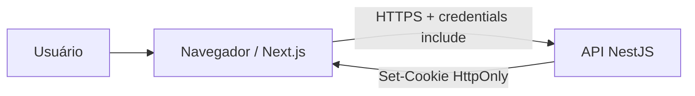

# ADR-003: Consumo direto da API pelo navegador

## Status

Aceita

## Data da decisão

2026-09-03

## Documentos relacionados

- [Requisitos do front-end](../Requisitos.md)
- [Contrato de integração](../Contrato-de-integracao.md)
- [Decisões de tecnologia](../Decisao-tecnologias.md)
- [Decisão de deploy](../Decisao-deploy.md)

## Contexto

O desafio tem como objetivo principal a API. A integração direta mantém autenticação, contratos e regras de segurança concentrados na API NestJS, sem duplicar implementações no projeto Next.js.

A API passa a controlar o JWT em cookie `HttpOnly`, CORS e a validação de origem das mutações. Com isso, o navegador pode consumi-la diretamente sem acessar o token e sem uma camada intermediária no Next.js.

## Decisão

O front-end chamará a API NestJS diretamente a partir do navegador. Não serão criados Route Handlers, proxy, Server Actions ou outro mecanismo do Next.js para intermediar autenticação e CRUD.



## Responsabilidades

### Front-end

- Renderizar formulários, dados e estados da experiência.
- Chamar os endpoints públicos da API configurada.
- Usar `credentials: include` em todas as requisições.
- Fazer mutações apenas a partir de uma origem autorizada pela API, sem cabeçalho CSRF customizado.
- Tratar `401` redirecionando para o login e apresentar os demais erros com mensagens seguras.
- Nunca ler, persistir, copiar ou registrar o JWT.

### API

- Cadastrar usuários e validar credenciais.
- Criar, validar e remover o cookie JWT.
- Aplicar CORS, validação de origem, autenticação, autorização e rate limit.
- Validar todos os dados independentemente da validação da interface.

### Execução no servidor do front-end

Não participa da comunicação autenticada. Server Components poderão renderizar conteúdo que não dependa do cookie da API, mas não atuarão como proxy nem tentarão acessar recursos protegidos em nome do navegador.

## Configuração e cliente HTTP

A URL base será exposta como configuração pública:

```env
NEXT_PUBLIC_API_URL=https://api.example.com
```

Um cliente HTTP compartilhado aplicará a URL base, `credentials: include` e o tratamento comum de respostas. Ele não adicionará cabeçalho CSRF customizado; funções específicas de cada feature definirão caminhos, payloads e tipos.

## Autenticação e proteção de páginas

O cookie é host-only da API e não pode ser lido pelo JavaScript nem pelo servidor do Next.js. Portanto, a proteção real ocorre quando o navegador chama a API:

1. A página protegida renderiza seu estado de carregamento.
2. O navegador solicita o recurso autenticado diretamente à API.
3. Em sucesso, a interface apresenta os dados.
4. Em `401 Unauthorized`, a interface descarta o estado local e redireciona para `/login`.

Não haverá verificação otimista de cookie em Middleware do Next.js. Esconder uma rota no front-end não será tratado como autorização; a API continuará sendo a autoridade.

## CORS, origem e domínios

O front-end só funcionará com uma origem cadastrada explicitamente pela API. Produção usará uma origem HTTPS na allowlist exata e pertencente ao mesmo site da API, permitindo o cookie `SameSite=Strict`.

Operações `POST`, `PATCH` e `DELETE` não enviam `X-CSRF-Protection` nem outro cabeçalho CSRF customizado. O navegador fornece `Origin` automaticamente; a API o valida e usa `Referer` apenas quando `Origin` estiver ausente. O cliente não deve tentar definir nenhum desses cabeçalhos.

Previews hospedados em domínio de terceiro não usarão a sessão da API de produção. Testes integrados deverão executar em origem controlada e autorizada.

## Testes

- O cliente HTTP chama `NEXT_PUBLIC_API_URL` sem prefixo intermediário `/api`.
- Todas as chamadas usam `credentials: include`.
- Métodos mutáveis não enviam cabeçalho CSRF customizado e funcionam somente a partir de origem autorizada.
- Login bem-sucedido funciona sem expor o JWT ao JavaScript.
- A sessão expira após 900 segundos e retorna ao fluxo de login.
- Resposta `401` em página protegida redireciona para o login.
- O cliente interpreta o schema padrão de erro e preserva o identificador de correlação para suporte.
- Cadastro, paginação, CRUD e logout funcionam sem endpoints intermediários.
- Busca residual confirma ausência de endpoints intermediários e configuração server-side para a API.

## Consequências

### Positivas

- Não há duplicação dos endpoints da API dentro do Next.js.
- A arquitetura mantém o foco do desafio no back-end.
- Uma chamada HTTP é eliminada de cada operação.
- O rate limit da API recebe o IP observado na conexão do navegador pela cadeia confiável de proxies.
- O front-end pode ser entregue sem runtime server-side dedicado à integração.

### Negativas

- A API precisa configurar CORS, cookie e validação de origem corretamente.
- O front-end não consegue validar a sessão no servidor do Next.js.
- Páginas protegidas precisam de estado de carregamento enquanto a API confirma a sessão.
- Domínios de preview de terceiros não compartilham a sessão `SameSite=Strict` de produção.

## Alternativas consideradas

Armazenar o JWT em `localStorage` permitiria usar Bearer diretamente, mas exporia o token ao JavaScript e aumentaria o impacto de XSS. Foi rejeitado.

Compartilhar o cookie com o domínio do front-end permitiria inspeção server-side, mas ampliaria seu escopo para outros hosts. Foi rejeitado em favor de cookie host-only controlado pela API.
